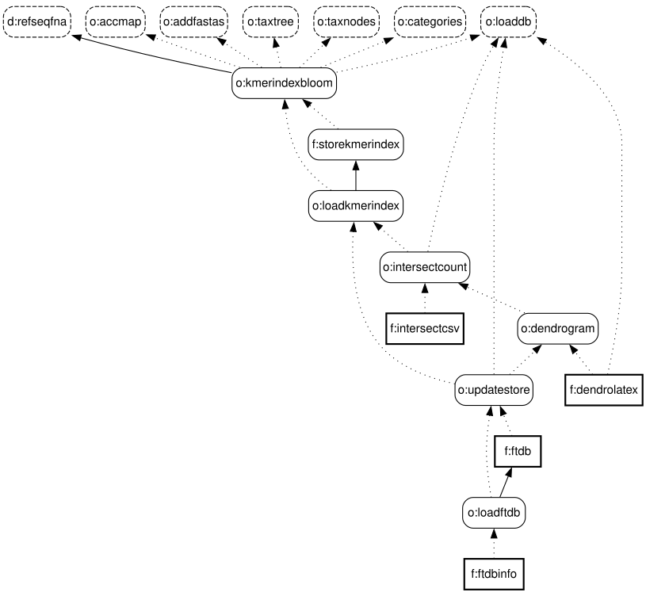

[comment]: # (“Commons Clause” License Condition v1.0)
[comment]: # ()  
[comment]: # (The Software is provided to you by the Licensor under the License,)
[comment]: # (as defined below, subject to the following condition.)
[comment]: # ()  
[comment]: # (Without limiting other conditions in the License, the grant of rights under the License)
[comment]: # (will not include, and the License does not grant to you, the right to Sell the Software.)
[comment]: # ()
[comment]: # (For purposes of the foregoing, “Sell” means practicing any or all of the rights granted)
[comment]: # (to you under the License to provide to third parties, for a fee or other consideration)
[comment]: # (including without limitation fees for hosting or consulting/ support services related to)
[comment]: # (the Software, a product or service whose value derives, entirely or substantially, from the)
[comment]: # (functionality of the Software. Any license notice or attribution required by the License)
[comment]: # (must also include this Commons Clause License Condition notice.)
[comment]: # ()
[comment]: # (Software: genestrip-ft)
[comment]: # ()
[comment]: # (License: Apache 2.0)
[comment]: # ()
[comment]: # (Licensor: Daniel Pfeifer, daniel.pfeifer@progotec.de)

**Genestrip-FT**: Optimizing Genestrip's *k*-mer databases for accuracy on the genus level
===============================================

## Introduction

Genestrip-FT is an extension of [Genestrip](https://github.com/pfeiferd/genestrip), so most of its functionality is inherited from
Genestrip. Please consult [Genestrip's documentation](https://github.com/pfeiferd/genestrip/blob/master/README.md) before dealing with this project.

Genestrip-FT addresses a major problem
of *k*-mer databases under the genus rank: Due to the lowest common ancestor update (LCA update) for each stored *k*-mer, a *k*-mer 
is pushed to the genus already if it is shared by just two species subordinate to that genus.
As a result, a *k*-mer database's accuracy tends to descrease under the species rank when used for metagenomic analysis given that the collection
of genomes used for the LCA update is large. The effect has been studied in detail in [this research publication](https://link.springer.com/article/10.1186/s13059-018-1554-6).

Genestrip-FT addresses this problem by *refining the NCBI's [taxonomy tree](https://www.ncbi.nlm.nih.gov/taxonomy/)* as included in a Genestrip database via the following steps:
1) Based on the goal `kmerindexbloom`: Genestrip-FT performs an analysis for each *k*-mer stored right under the genus rank in order to determine from which species it was pushed up as part of the
LCA update that happened when the database was built. 
2) Based on the goal `intersectcount`: After collecting statistics on all related *k*-mers it computes a degree of intersection between
any two species that belong to the same genus using the Jaccard-index. The intersection is computed via the number
of joint *k*-mers between such two species as stored right under the genus rank.
3) Based on the goal `dendrogram`: The Jaccard-indices of any two species under the same genus form a symmetric real-valued matrix. The matrix forms a similarity measure for species that aids to compute a dendrogram via agglomerative clustering
using single linkage as the cluster distance . 
4) Based on the goal `updatestore`: The tree included in the dendrogram is used
to refine the actual taxonomy tree as stored along with the database. In addition, the *k*-mers originally assigned to 
the genus are pushed down to their according, newly included nodes in the refined taxonomy tree .
5) Based on the goal `ftdb`: Finally, the reworked Genestrip database gets stored and can then be used for improved metagenomic analysis.

The default ranks for the refinement of the taxanomy tree are `` and `` but other ranks can be set via a [configuration parameter](https://github.com/pfeiferd/genestrip/blob/master/ConfigParams.md).
In addition, refinement can be enforced for specific tax ids as well.

### Generating and optimizing the sample database

The Genestrip-FT installation holds additional folders for the sample project `virus`. The project allows for generating a Genestrip database covering all *k*-mers for all viruses from the RefSeq.

After building Genestrip-FT, you may call
`sh ./bin/genestrip-ft.sh virus ftdbinfo`
in order to generate the basic *and the optimized* `virus` database and create CSV files with information on their content.
The optimized database file `virus_ftdb.zip` will be stored under `./data/projects/virus/db` and the respective CSV file `virus_ftdbinfo.csv` will be stored under `./data/projects/virus/csv`

When comparing the CSV file `virus_dbinfo.csv` with the optimized database's info file `virus_ftdbinfo.csv` you will
notice additional entries reflecting the refined taxonomy under genus rank.
E.g., `virus_ftdbinfo.csv` contains the following additional entries:
``

## Examining intermediate results

The counts for *k*-mer intersections and the associated matrix with the Jaccard-indices from step 2 from above can be written
to a CSV-file via the goal `intersectcsv`. A separate CSV-file will be written for each affected genus.
The corresponding files will be saved under `<base dir>/projects/<project_name>/csv` following the
pattern `<project_name>_intersectcsv_<genus_tax_id>.csv`.

Similarly, dendrograms from step 3 from above can be exported as LaTeX-extracts via the goal `dendrolatex`.
A separate file will be written for each affected genus.
The corresponding files will be saved under `<base dir>/projects/<project_name>/txt` following the
pattern `<project_name>_dendrolatex_<genus_tax_id>.txt`. 
A corresponding extract is meant to be embedded in a [LaTeX](https://www.latex-project.org/) document and requires the LaTeX package [TikZ](https://github.com/pgf-tikz/pgf).

You may apply the two goals to the included sample project `virus` via
`sh ./bin/genestrip-ft.sh virus intersectcsv dendrolatex`.

The following dendrogram results from applying the goal `dendrolatex` to the Genestrip project `borrelia` from [Genestrip-DB](https://github.com/pfeiferd/genestrip-db/).
As it is based on the *k*-mers shared between any two species under the genus Borreliella, it forms a phylogenetic tree.
Indeed, the tree's structure is very similar to [the phylogenetic tree for Borreliella established by current research](https://doi.org/10.3390/life13040972).

## License

[Like Genestrip itself, Genestrip-FT is free for non-commercial use.](./LICENSE.txt) Please contact [daniel.pfeifer@progotec.de](mailto:daniel.pfeifer@progotec.de) if you are interested in a commercial license.

## Building and installing

Genestrip-FT is structured as a standard [Maven 2 or 3](https://maven.apache.org/) project and is compatible with the [JDK](https://jdk.java.net/) 11 or higher.[^1]

To build it, `cd` to the installation directory `genestrip-ft`. Given a matching Maven and JDK installation, `mvn install` will compile and install the Genestrip-FT program library. Afterwards a self-contained and executable `genestrip-ft.jar` file will be stored under `./lib`. 

## Technical documentation

### Usage and goals

The usage of Genestrip-FT:
```
usage: genestrip-ft [options] <project> [<goal1> <goal2>...]
 -C <key>=<value>           To set Genestrip configuration paramaters via
                            the command line.
 -d <base dir>              Base directory for all data files. The default
                            is './data'.
 -db <database>             Path to filtering or matching database for the
                            goals 'filter' or 'match', 'matchlr', 'dbinfo'
                            and 'db2fastq' for use without project
                            context.
 -f <fqfile1,fqfile2,...>   Input fastq files as paths or URLs to be
                            processed via the goals 'filter', 'match' or
                            'matchlr'. When a URL is given, the fastq file
                            will not be downloaded but data streaming will
                            be applied unless '-l' or '-ll' is given.
 -k <key>                   Key used as a prefix for naming result files
                            in conjuntion with '-f'.
 -l                         Download fastqs from URLs to '<base
                            dir>/projects/<project name>/fastq' instead of
                            streaming them for the goals 'filter', 'match'
                            and 'matchlr'.
 -ll                        Download fastqs from URLs to '<base
                            dir>/fastq' instead of streaming them for the
                            goals 'filter', 'match' and 'matchlr'.
 -m <fqmap>                 Mapping file with a list of fastq files to be
                            processed via the goals 'filter', 'match' or
                            'matchlr'. Each line of the file must have the
                            format '<key> <URL or path to fastq file>'.
 -r <path>                  Common store folder for filtered fastq files
                            and result files created via the goals
                            'filter', 'match' or 'matchlr'. The defaults
                            are '<base dir>/projects/<project name>/fastq'
                            and '<base dir>/projects/<project name>/csv',
                            respectively.
 -t <target>                Generation target ('make', 'clean' or
                            'cleanall'). The default is 'make'.
 -tx <taxids>               List of tax ids separated by ',' (but no
                            blanks) for the goal 'db2fastq'. A tax id may
                            have the suffix '+', which means that
                            taxonomic descendants from the project's
                            database will be included.
 -v                         Print version.                            
```

### Additional goals

[**This is a list of all goals**](Goals.md)
[in addition to the ones from Genestrip](https://github.com/pfeiferd/genestrip/blob/master/Goals.md).

The extended goal graph is shown below. Dashed boxes are goals inherited from Genestrip -
so this is where Genestrip-FT (also) relies on Genestrip's respective implementations.
Please keep in mind that the entire graph is a union of the graph from below and [Genstrip's original goal graph](https://github.com/pfeiferd/genestrip/blob/master/GoalGraph.svg).

<p align="center">
  
</p>

### Additional configuration parameters

[**This is a list of all configuration parameters**](ConfigParams.md)
[in addition to the ones from Genestrip](https://github.com/pfeiferd/genestrip/blob/master/ConfigParams.md).